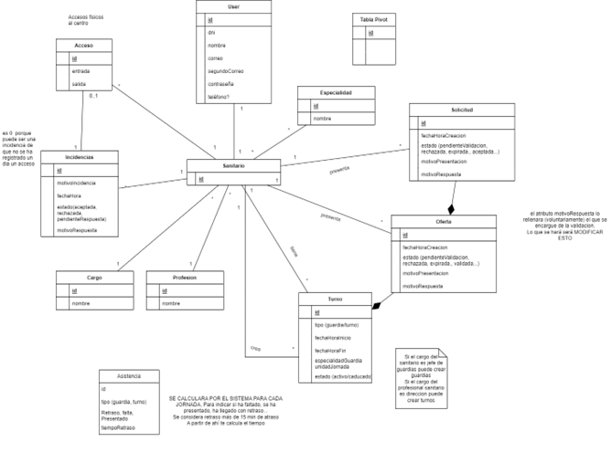


Contenido

[**Preguntas:**  **1**](#_Toc130322195)

[**1.Dominio del problema:**  **1**](#_Toc130322196)

[**2.Objetivos:**  **1**](#_Toc130322197)

[**3.Usuarios del sistema:**  **2**](#_Toc130322198)

[**4.Requisitos de información:**  **3**](#_Toc130322199)

[**5.Requisitos funcionales:**  **4**](#_Toc130322200)

[**6.Reglas de negocio:**  **8**](#_Toc130322201)

[**7.Requisitos no funcionales:**  **9**](#_Toc130322202)

[**8.Modelo conceptual UML****.** **10**](#_Toc130322203)

# Preguntas:

Pk separar en dos tablas ofertas y solcitudes?

Creo una tabla con información de la asistencia, o hago que me lo calcule el sistema.

# 1.Dominio del problema:

En la actualidad el sistema por el que se rigen las jornadas laborales de los profesionales sanitarios es muy complejo. Eventos como las guardias, los cambios de turnos o las rotaciones entre centros son el pan de cada día en el sector. Esto hace que la organización de este sistema sea muy difícil de gestionar y que en muchas ocasiones no se lleguen a registrar muchos de estos sucesos.

# 2.Objetivos:

El objetivo de nuestro sistema será capacitar a los profesionales del sector de una herramienta que les permita tanto a la dirección como a los profesionales sanitarios una forma de gestión que solvente eficaz y eficientemente la problemática anterior . Facilitando en gran medida los procesos y permitiendo que los propios profesionales tengan un papel protagonista en estos. Los principales objetivos de nuestro sistema serán:

**OBJ-1. Control/Gestión de los accesos al centro hospitalario:**

Nuestro sistema tendrá como uno de sus objetivos llevar a cabo un control/seguimiento de los accesos al centro hospitalario por parte del personal sanitario. Permitiendo registrar con exactitud el número de horas ejercidas por los profesionales, evitar la saturación del personal, notificar incidencias en los accesos, detectar posibles fraudes…

**OBJ-2. Registro y gestión asistencial del personal sanitario:**

Nuestro sistema tendrá como uno de sus objetivos llevar a cabo el registro y la gestión asistencial del personal sanitario. Permitiendo registrar las faltas y los retrasos de los profesionales

**OBJ-3. Gestión de las guardias de los profesionales:**

Nuestro sistema tendrá como uno de sus objetivos llevar a cabo la gestión de guardias del personal sanitario. Permitiendo registrar las guardias de los profesionales, consultar la fecha y hora de las guardias, permitir cambios de guardia entre profesionales…

**OBJ-4. Gestión de los turnos de los profesionales:**

Nuestro sistema tendrá como uno de sus objetivos llevar a cabo la gestión de los turnos del personal sanitario. Permitiendo registrar los turnos de los profesionales, consultar la fecha y hora de los turnos, permitir cambios de turnos entre profesionales…

**OBJ-5. Registro y gestión de información del personal sanitario:**

Nuestro sistema tendrá como uno de sus objetivos llevar a cabo el registro y la gestión de la información del personal sanitario. Permitiendo registrar información personal sobre los profesionales, sobre su especialidad, cargo…

# 3.Usuarios del sistema:

Los tipos de usuarios que podrán acceder al sistema y hacer un uso específico de este serán:

<![if !supportLists]>- <![endif]>Profesionales Sanitarios (médicos y enfermeros) .

<![if !supportLists]>- <![endif]>Dirección

<![if !supportLists]>- <![endif]>Jefes de guardia.

<![if !supportLists]>- <![endif]>Administrador

# 4.Requisitos de información:

**RI-001. Información sobre los usuarios:** El sistema deberá almacenar datos personales sobre todos los usuarios. Dirección de correo electrónico principal y segundario, contraseña y nombre.

**RI-002. Información sobre el personal sanitario:** El sistema deberá almacenar datos del personal sanitario. Tipo de profesión (médico y enfermero), especialidad médica y cargo dentro del sistema hospitalario (Dirección, jefe de guardias, sanitario normal).

**RI-003. Información sobre las especialidades médicas:** El sistema deberá almacenar datos sobre las especialidades médicas del personal sanitario. Tipo de especialidad (cardiología, radiología y pediatría), _año de finalización y centro titular donde se llevo a cabo. (No sé si lo haré al final)_

**RI-004. Información sobre los accesos al centro sanitario:** El sistema deberá registrar datos sobre los accesos al centro sanitario por parte del personal sanitario .Fecha y hora de entrada y fecha y hora de salida.

**RI-006. Información sobre los turnos:** El sistema deberá registrar datos sobre los turnos del personal sanitario. Tipo de turno (guardia o normal), fecha y hora del inicio del turno, fecha y hora de final del turno, si está activa o no, tipo de turno y especialidad de este.

**RI-007. Información sobre incidencias :** El sistema deberá registrar datos sobre las incidencias (con respecto a problemas con los accesos) que notifiquen el personal sanitario. Fecha y hora en la que se realiza la incidencia, motivo de la incidencia, acceso a la que hace referencia , estado de la incidencia (aceptada, rechazada, pendienteRespuesta), motivo de la respuesta y persona que la realiza.

Inicialmente un medico rellena todo menos el motivo de la respuesta y el estado (será pendiente respuesta) à cuando la direccion la responda indicará el estado y su motivo.

**RI-008. Información sobre intercambio de guardias :** El sistema deberá registrar datos sobre las solicitudes y ofertas en los intercambios de turnos entre los profesionales sanitarios. Tipo de evento, fecha y hora en el que se realiza, profesional que la realiza, motivo de la presentación, motivo de la respuesta, estado y la guardia en cuestión.

<![if !supportLists]>è <![endif]>Inicialmente cuando presente una persona una oferta por ejemplo, el motivo respuesta estará vacío (no dejará introducirlo en el formulario) y al responder (el jefe de guardia) rellenara este campo si lo ve necesario

**RI-019. Información sobre asistencia :** El sistema deberá registrar datos sobre la asistencia del personal sanitario.

# 5.Requisitos funcionales:

**RF-001. Registro de usuarios: (todos los roles)**

Queremos que el sistema nos permita a los profesionales sanitarios registrarnos como usuarios con una contraseña y acceder al sistema.

**PROFESIONAL SANITARIO**

**RF-002. Cosultar accesos: (profesional sanitario )**

Quiero poder consultar mi historial de accesos al centro médico.

Si quiero q un medico tenga dos usuarios distintos uno para hacer de jefe de guardias, y otro de personal sanitario ¿que te parece?

**RF-003. Filtrar accesos: (profesional sanitario)**

Quiero poder filtrar por [fechas] mi historial de accesos al centro médico.

**RF-004. Registro de incidencias: (profesional sanitario)**

Quiero poder notificar de cualquier incidencia sobre los registros de mis accesos.

**RF-005. Consultar el calendario/cuadrante de guardias/turnos: (profesional sanitario)**

Quiero poder consultar el calendario/cuadrante mensual de guardias de mi misma especialidad y profesión (enfermeros/médicos)

**RF-006. Filtrar el calendario/cuadrante de guardias/turnos: (profesional sanitario)**

Quiero poder filtrar por [fecha, tipo, hora] las guardias del calendario/cuadrante mensual de guardias de mi misma especialidad y profesión (enfermeros/médicos)

**RF-007. Interactuar con el calendario/cuadrante de guardias/turnos: (profesional sanitario)**

Quiero poder interactuar con el calendario/cuadrante mensual de guardias de mi misma especialidad y profesión.

**RF-008. Ofertar guardias/turno: (profesional sanitario)**

Quiero poder ofertar mis guardias al resto de profesionales (para un posible cambio) en el cuadrante mensual de guardias.

**RF-009. Retirar oferta guardias/turnos: (profesional sanitario)**

Quiero poder retirar mis ofertas (todas o una en concreto) de guardias.

**RF-010. Consultar informacion sobre mis ofertas de guardias/turnos: (profesional sanitario)**

Quiero poder consultar el estado de mis ofertas, y que profesionales han presentado solicitudes a mis ofertas.

**RF-011. Consultar guardias/turno ofertadas: (profesional sanitario)**

Quiero poder consultar en el cuadrante mensual de guardias cuales están ofertadas, sus fechas, horas, nombre del ofertante y motivo por el que se ha ofertado.

**RF-012. Solicitar guardias/turnos ofertadas: (profesional sanitario)**

Quiero poder solicitar una guardia del cuadrante que esté ofertada.

**RF-013. Consultar estado de mis solicitudes de guardias/turnos: (profesional sanitario)**

Quiero poder consultar el estado de mis solicitudes de cambio de guadria.

**RF-014. Retirar solicitudes de guardias/turnos ofertadas: (profesional sanitario)**

Quiero poder retirar mis solicitudes de guardia del cuadrante.

**RF-015. Filtrar guardias/turnos ofertadas: (profesional sanitario)**

Quiero poder filtrar por [fechas] una guardia del cuadrante que esté ofertada.

**JEEFE DE GUARDIA****à** Hay un jefe de guardia para cada especialidad?

**RF-015. Crear cuadrante de guardias: (jefe de guardia)**

Quiero poder crear los registros de las guardias correspondiente al personal sanitario. A través de un formulario donde pongo todos los valores guardia por guardia y además  a través de un formulario especial generador de guardias donde indicando la persona y el número de guardias que quiero registrarle me salga este formulario con los huecos correspondientes a este número de guardias.

(3 guardias Juan à formulario guardias de Juan con 3 partes para poner los datos de la guardia 1, la  2 y la 3)

**RF-016. Modificar cuadrante de guardias: (jefe de guardia)**

Quiero poder modificar los registros de las guardias correspondiente al personal sanitario.

**RF-017. Consultar ofertas de guardias: (jefe de guardia)**

Quiero poder consultar las ofertas de cambios de guardias del personal sanitario.

**RF-018. Rechazar ofertas de guardias: (jefe de guardia)**

Quiero poder rechazar ofertas de cambios de guardias del personal sanitario.

**RF-019. Rechazar ofertas de guardias 2: (jefe de guardia)**

Quiero que cuando rechaze una oferta se rechazen automáticamente  todas las solicitudes asociadas a esta y se actualice automáticamente el motivoRespuesta. (indicar motivo del rechazo “Se ha denegado la oferta a la que estaba apuntando”)

**RF-020. Consultar solicitudes de las ofertas de guardia: (jefe de guardia)**

Quiero poder consultar en un listado todas las solicitudes para cada una de las ofertas de guardia.

Este listado ofertas/solicitudes tendría un formato como:

Oferta Guardia 14-1-30 (Pedro)/ 20:24 à Urgencias

Solicitud Guardia 14-1-30 (Juan)/ 16-2-1 14:10 (Ordenados cronologicamente)

Solicitud Guardia 14-1-30 (María)/ 16-2-1 17:10

Oferta Guardia 16-2-30 (Julia)/ 20:12 à Oftalmología

…

**RF-021. Ordenar listado de ofertas/solicitudes de las ofertas de guardia: (jefe de guardia)**

Quiero poder ordenar las ofertas del listado de ofertas/solicitudes por [fecha de la guardia, tiempo que lleve la oferta sin responder]

**RF-022. Filtrar solicitudes de ofertas de guardia: (jefe de guardia)**

Quiero poder filtrar las solicitudes de cambios por [una guardia concreta, fecha, nombre médico oferta, especialidad].

**RF-023. Válidar cambios de guardias: (jefe de guardia)**

Quiero poder validar/confirmar cambios de guardias entre el personal sanitario. Clickando en la solicitud en concreto a validar (en el listado de ofertas/solicitudes)

**RF-024. Rechazos al válidar cambios de guardias: (jefe de guardia)**

Quiero que cuando valide un cambio de guardias (una solicitud) el resto de solicitudes se rechacen directamente. Se actualicen el estado de las ofertas y solicitudes implicadas a ”rechazada”. Clickando en la solicitud en concreto a validar (en el listado de ofertas/solicitudes) (indicar motivo del rechazo  “Se ha cambiado a otro compañero”).

**RF-025. Rechazar cambios de guardias: (jefe de guardia)**

Quiero poder rechazar solicitudes de cambio de guardia. Clickando en la solicitud en concreto (en el listado de ofertas/solicitudes) (indicar motivo del rechazo “Se ha denegado la solicitud debido ”)

**DIRECCION (añadir turnos…)**

**RF-026. Consultar médicos por unidades: (direccion)**

Quiero poder consultar un listado de profesionales con su información por [unidad y profesión].

Ej: Médicos:

Raul…

Alba…

Enfermeros:

Diana…

**RF-026. Consultar accesos: (direccion)**

Quiero poder consultar los accesos en los accesos al centro de los profesionales saniarios.

**RF-027. Consultar incidencias: (direccion)**

Quiero poder consultar las incidencias en los accesos presentadas por los profesionales.

**RF-028. Ordenar incidencias: (direccion)**

Quiero poder ordenar por [fecha de presentación] las incidencias en los accesos presentadas por los profesionales.

**RF-029. Responder incidencias: (direccion)**

Quiero poder responder a las incidencias haciendoles saber el motivo de la resolución.

**RF-030. Modificar accesos: (direccion)**

Quiero poder modificar la información sobre los accesos al centro de cada profesional.

**RF-031. Consultar accesos: (direccion)**

Quiero poder consultar la suma del número de horas trabajadas mensuales de cada profesional.

Esto no sé si debería crear una tabla para registrarlos y guardarlos o que se me calcularan cada vez que quiero verlos. A partir de los registros de accesos y turnos y guardias

**RF-031. Consultar las faltas de cada profesional: (direccion)**

Quiero poder consultar un listado de faltas de cada profesional (tanto de faltas como de turnos normales).

**RF-032. Consultar las atrasos de cada profesional: (direccion)**

Quiero poder consultar un listado de atrasos de cada profesional (tanto de faltas como de turnos normales).

**TAMBIÉN SERÍAN TODAS LAS FUNCIONALIDADES QUE TIENEN LOS JEFES DE GUARDIA PERO CON LOS TURNOS (en vez de las guardias).**

**RF-031. Modificación de cuadrante por intercambio: (sistema)**

El sistema deberá actualizar automáticamente el calendario mensual de guardias cuando un intercambio sea validado por un jefe de guardia.

**RF-006. Creación del calendario con cuadrante de guardias :** El sistema deberá formar un calendario mensual con el cuadrante de guardias de cada especialidad y tipo. à MUY COMPLEJO

# 6.Reglas de negocio:

**RN-001.  :** Un profesional sanitario no podrá ofertar más de 10 turnos en un mes.

**RN-002.  :** Un profesional sanitario no podrá tener más de 9 solicitudes pendientes de validar de turnos en un mes.

**RN-003.  :** Un profesional sanitario no podrá tener más de 4 solicitudes pendientes de validar de guardias en un mes.

**RN-004.  :** Un profesional no podrá ofertar una de sus guardias 24h antes de su inicio.

**RN-005.  :** Un profesional no podrá tener relacionadas dos guardias con al menos 12h de diferencia (como lo indica la norma)

**RN-006.  :** El jefe de guardia de un tipo y especialidad concreta solo podrá modificar y crear el cuadrante de ese tipo y especialidad. Por ejemplo,  el jefe de guardia de enfermeros solo podrá modificar el cuadrante de enfermeros.

**RN-007.  :** Un profesional solo podrá solicitar un cambio de guardia de un tipo compatible con su especialidad y tipo de profesión.

**RN-008.  :** Un intercambio de guardias entre profesionales no se efectuará hasta que el jefe de guardias de las características correspondientes no valide el cambio.

**RN-009.  :** Un intercambio de guardias entre profesionales residentes tendrá que ser validado tanto por el jefe de guardia como por el jefe de residentes al cargo.

# 7.Requisitos no funcionales:

**RNF-001.  Disponibilidad del sistema:**

El sistema debe de tener una disponibilidad del 99,96%.

# 8.Modelo conceptual UML

